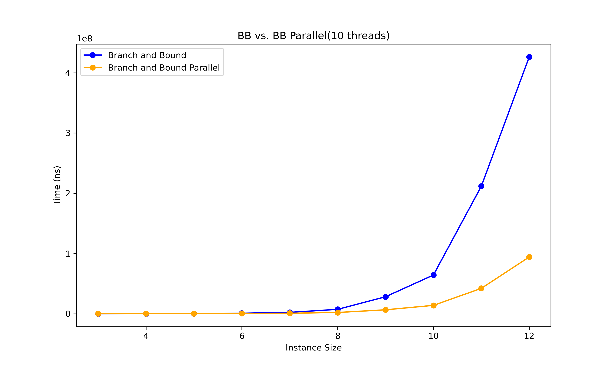

# Traveling Salesman Solver

This repository contains the Traveling Salesman Solver project.  
The solver is a command-line application that uses a branch-and-bound algorithm (with an optional parallel version) to solve instances of the Traveling Salesman Problem (TSP) exactly.  
The program loads a `.dot` format file containing the graph, computes the optimal solution, and displays the result in the terminal.  
Users can also save the solution once the instance is solved; an option will be presented in the terminal upon completion.

## The Problem Formulation

The Traveling Salesman Problem (TSP) is a very famous problem in Computer Science. 
Especially because a polynomial algorithm has not been found, therefore TSP is a NP-hard problem.
The Traveling Salesman Problem (TSP) asks the following:  
Given a list of cities and the distances between each pair of cities,  
what is the shortest possible route that visits each city exactly once and returns to the origin city?

It is not particularly hard to define the problem, but it is tough to solve it effectively (maybe even impossible).

The mathematical definition would be:  
Given a directed, weighted graph $` G = (N, E) `$, where:  
$` N = \{v_1, v_2, \dots, v_n\} `$ is a set of nodes,  
$` E = \{e_1, e_2, \dots, e_n\} `$ is a set of edges,  
$` w: E \to \mathbb{R}^+ `$ is a weight function, returning the weight of an edge.

An alternative definition for set $ E $ is that it is a relation on a set of nodes $` E \subseteq N \times N `$.
Then the weight function would be defined as $` w: N \times N \to \mathbb{R}^+ `$ or $` w: (v_i, v_j) \to \mathbb{R}^+ `$ where $` v_i, v_j \in N `$.

The goal is to find a Hamiltonian cycle $` H \subseteq E `$ such that:
1. Each node in $` N `$ is visited exactly once, and at the end returns to the starting node.
2. The total weight of $` H `$ is minimal.

### Objective Function:
Find a permutation $` \pi `$ of $` \{1, 2, \dots, n\} `$ such that the total cost of the cycle $` C(\pi) `$ is minimized:

$$
\min C(\pi) = \sum_{i=1}^{n} w(v_{\pi(i)}, v_{\pi(i+1)})
$$

where $` \pi(n + 1) `$ is defined as $` \pi(1) `$ to complete the cycle.

The easiest solution would be to find every permutation and see what the total weight would be.  
Then, find the set of Hamiltonian cycles with the minimal path.  
The problem here is that the computational complexity of such an algorithm is $` O(n!) `$, and therefore,  
we will very quickly find ourselves in a place where we are unable to find the solution in normal time.
(In practice, the complexity is $` O\left( (n-1)! \right) `$ because we can set one node to be always first). 
If we was dealing with undirected graphs, the complexity would be $` O\left( \frac{(n-1)!}{2} \right) `$.
But that is still growing incredibly fast:  

| $` n `$ | $` O\left( (n-1)! \right) `$            | $` O\left( \frac{(n-1)!}{2} \right) `$       |
|-------|---------------------|------------------|
| 3     | 2                   | 1                |
| 4     | 6                   | 3                |
| 5     | 24                  | 12               |
| 6     | 120                 | 60               |
| 7     | 720                 | 360              |
| 8     | 5,040               | 2,520            |
| 9     | 40,320              | 20,160           |
| 10    | 362,880             | 181,440          |
| 11    | 3,628,800           | 1,814,400        |
| 12    | 39,916,800          | 19,958,400       |
| 13    | 479,001,600         | 239,500,800      |
| 14    | 6,227,020,800       | 3,113,510,400    |
| 15    | 87,178,291,200      | 43,589,145,600   |
| 16    | 1,307,674,368,000   | 653,837,184,000  |
| 17    | 20,922,789,888,000  | 10,461,394,944,000 |
| 18    | 355,687,428,096,000 | 177,843,714,048,000 |
| 19    | 6,402,373,705,728,000 | 3,201,186,852,864,000 |
| 20    | 121,645,100,408,832,000 | 60,822,550,204,416,000 |

The next possibility is to solve the Traveling Salesman by converting it into a Linear Program (LP).
However, this was not an approach that I have used.

The Branch and Bound algorithm is a widely popular choice for solving TSP. 
It is known for its strong practical performance and its ability to be parallelized with ease. 
This makes it an excellent approach for my work.

## Approximation

The most efficient way to get a good solution for a Traveling Salesman Problem instance is not by solving it exactly, but by finding a path that, while not necessarily optimal, is still very good.  
This method, known as approximation, can be performed much more quickly than exact methods.  
In real-life scenarios, approximation is often preferred over exact solutions, especially when dealing with large instances that contain many nodes and edges (e.g., 1,000 or 10,000 nodes).  


## Branch and Bound Algorithm

Branch and Bound (B&B) are a powerful algorithms for finding exact solutions to problems in Combinatorial Optimization, particularly Linear Programs.  
It systematically explores the search space while eliminating branches (subproblems) that cannot lead to a better solution than the current best.  
We will be using the B&B algorithm for solving the Traveling Salesman Problem (TSP).

### Steps

1. **Initialization**
   - Start with a best tour approximation using an approximation algorithm (such as Nearest Neighbour + 2-Opt, in our case), or infinity.

2. **Bounding Function**
   - Define a bounding function that calculates the lower bound for every partial tour explored.

3. **Branching**
   - The branching step generates new subproblems by exploring the search space tree.

4. **Bounding**
   - Every time the lower bound calculated by the bounding function is higher than the best result so far, the subproblem is pruned and not explored further.

5. **Termination**
   - The algorithm terminates when all tours have been either explored or pruned, and the current best solution is the optimal solution for the Traveling Salesman Problem (TSP).

#### My bounding function
I will use a basic bounding function due to its simplicity and fast execution. 
While it is quick to implement and runs efficiently, 
its main drawback is that it does not provide as aggressive a bound as more sophisticated methods, 
such as those based on Minimum Spanning Trees (MST). 
As a result, it may not prune the search space as effectively, 
potentially leading to less optimal performance in comparison to more advanced bounding techniques.

The function:

$` N_v = \{v_1, v_2, \dots, v_n\} `$ is the subpath chosen by the algorithm,  
$` N_u = \{u_1, u_2, \dots, u_m\} = N \setminus N_v `$ is the set of nodes not yet included in the path.  

$$ 
b(N_v, N_u) = \sum_{i=1}^{n} w(v_{i}, v_{i+1}) + \sum_{i=1}^{m} w(min(u_i))
$$

Here, $` \min(u) `$ denotes the minimal outgoing edge $` e `$ from node $` u `$, where $` e = (u, v) `$ and $` v \in N \setminus \{u\} `$

### Pseudo-code:
```plaintext
1. Initialize:
   best_solution = infinity (or a heuristic approximation)
   Create an initial node (partial tour with a single city)

2. For each neighbour of the current node:
   - If the neighbour is already in the subtour, continue
   - Connect the neighbour to the current sub-tour
   - If the bound is <= minimal tour, call recursive search()
   - If the length of the tour equals the number of nodes:
      - If the cost is less than the minimal tour cost, 
            clear the set of best tours and add the current tour
      - Else if the cost is the same as the minimal cost, 
            add the current tour to the set of best tours

3. Return best_solution as the optimal tour
```

The solution time with Branch and Bound is significantly better when compared to the brute-force approach:


However, even with B&B, we cannot always guarantee that the problem will be solved in a reasonable amount of time.

### Parallelization

The Branch and Bound (B&B) algorithm can be parallelized, and its performance improves significantly when using multiple threads. 
In the parallelized version, we must start with an initial heuristic approximation and not an estimate of infinity. 
The pseudocode is similar to the synchronized version, but there are some differences.

The primary change involves synchronizing access to the best tours set and the minimal cost. 
To achieve this, I use two mutexes to ensure that updates are thread-safe. 
However, the biggest challenge is ensuring Depth-First Search (DFS) is used instead of Breadth-First Search (BFS). 
To address this, the method call is added to the thread pool, but only for the first neighbor does the thread continue its search.

The parallelized version of B&B performs much better than the synchronized version:


The scaling of the algorithm with varying numbers of threads is also impressive:


## Implementation
...

## How to Use TSS

After compiling the code on your machine, you need to find the executable file called `tss`.
You can execute this file with various arguments. 
If executed with no arguments or with `-h` or `--help`, a help window will show.

```bash
./tss --help
```

### Loading Instances into Program Queue
The first step is to load instances into the program queue and then solve them. 
There are multiple ways to do this.

#### Load Instances
```bash
./tss -l "instance_name.dot"
```
This command will load instance from `/files/instances` folder.

#### Auto load Instances
```bash
./tss -a
```
This command will load all instances stored in the `/files/instances` folder.

#### Create Synthetic Instance
```bash
./tss -c 10
```
This command will create a synthetic instance. You need to specify how many nodes the instance should have. 
The weights will be assigned randomly. 
The instance will then be loaded into the queue.

### Solving loaded instances

#### Branch and Bound solve
```bash
./tss -s
```
This command will solve all instances in the queue using the synchronous branch and bound algorithm.

#### Branch and Bound Parallel solve
```bash
./tss -p 8
```
This command will solve all instances in the queue using the parallel branch and bound algorithm. 
You need to specify the number of threads the program can use.

#### Heuristic approximation
```bash
./tss -e
```
This command will approximate the solution using the Nearest Neighbor & 2-Opt heuristic approach. 
This is the same method used by the Branch and Bound and Branch and Bound Parallel algorithms to approximate solutions.

### How to run?
You need to load the instances first and then pick a solving method(or approximation).
An example command to load all instances and solve using 10 threads:
```bash
./tss -a -p 10
```