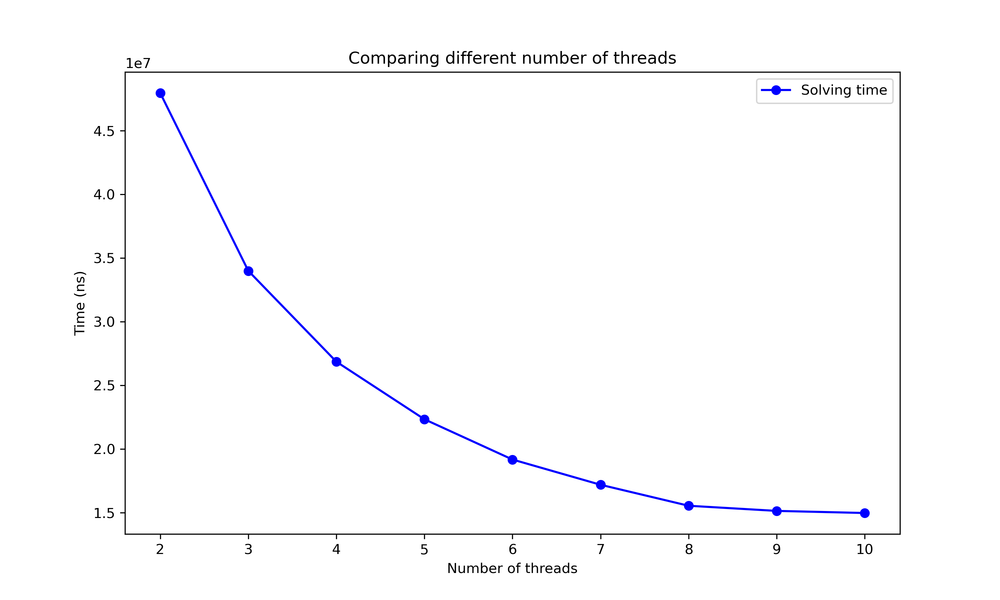

# Traveling Salesman Solver

This is a repository for Traveling Salesman Solver project. 
This solver is a command line program that uses branch and bound(also parallel version)
to solve the traveling salesman problem instances exactly.
The program loads
the file in a .dot format and shows the solution in the terminal.
User can also save the 
 solution (there will be an option in the terminal once instance is solved).  

## The Problem Formulation
Traveling salesman is a very famous problem in Computer Science.
Traveling Salesman problem or TSP asks the following:  
Given a list of cities and the distances between each pair of cities,
what is the shortest possible route that visits each city
exactly once and returns to the origin city?  

It is not particularly hard to define the problem, but it is tough to solve it effectively (maybe even impossible).  

The mathematical definition would be:  
Given a directed, weighted graph G = (N, E), where:  
N = {v1, v2, ..., vn} is a set of nodes,  
E = {e1, e2, ..., en} is a set of edges,
w: E -> R+ is a weight function, returning the weight of an edge.  

The goal is to find a Hamiltonian cycle H subset of E such that:
1. each node in N is visited exactly once, and at the end returns to the starting node.  
2. the total weight of the H is minimal.  

Objective Function:  
Find a permutation pi of {1, 2, .., n} such that the total cost of the cycle C(pi) is minimized:  
min C(pi) = sum(i = 1, n) w(a(pi(i), pi(i+1)))  
where pi(n + 1) is defined as pi(1) to complete the cycle.  

The branch of mathematics that studies this type of optimization problems is called Combinatorial Optimization.

The easiest solution would be to find every permutation and see what the total weight would be.
Then find the st of hamiltonian 
cycles with the minimal path.
The problem here is that the computational complexity of such an solution is O(n!) and therefore, 
we will very quickly find ourselves in a place where we are unable to find the solution in normal time(in practice the 
complexity is (n-1)! because we can set some node to be always first).  

The next possibility is to solve the Traveling Salesman by converting it into an LP(linear program).  

Very popular rhythmical is a branch and bound algorithm.
This algorithm finds the set of hamiltonian paths that 
are minimal and is considered exact algorithm.

## Approximation 
The best way to get a good result from a traveling salesman instance is
not by solving it exactly but by finding path
that doesn't have to be optimal but is great.
This method is called approximation and can be done very quickly.
In real life scenarios
is used much more that solving the instance exactly as there may be many nodes and edges(e.g., 1000, 10 000).


## Branch and Bound Algorithm
Branch and Bound (B&B) is a powerful algorithm for an exact solution of the travelling salesman problem.
It systematically explores the search space(all possible tours) while eliminating branches(subproblems)
that cannot lead to a better solution than the current best. The solution time is much better when compared to the brute force approach:

However, we still can't be sure that it will be calculated in reasonable time.

### Steps
1. Initialisation
   - Start with a best tour approximation using some approximation algorhythm(Nearest Neighbour + 2Opt) in our case.
2. Bounding function
   - We have to specify a bounding function that will calculate the lower bound for every partial tour taken.
3. Branching
   - The branching step involves generating new subproblems by exploring the search space tree. 
4. Bounding
   - every time the loer bound calculated by the bounding function is higher than the best result yet the subproblem is pruned and not explored further.
5. Termination
   - The algorithm terminates when all tours have been either explored or pruned, and the current best solution is the optimal solution for the TSP.

### Pseudo-code:
```plaintext
1. Initialize:
   best_solution = infinity (or a heuristic approximation)
   Create an initial node (partial tour with a single city)

2. For each neighbour of current node:
   - If the neighbour is already in this subtour then continue
   - Connect neighbour to the current sub-tour
   - If bound is <= minimal tour then recursive search()
   - If length of the tour is same as the number of nodes:
      - If the cost is less then minimal tour then clear the set of best tours and add there this tour
      - Else if cost is the same as the minimal cost then add current tour to the set of the best tours

3. Return best_solution as the optimal tour
```

### Parallelization
The Branch and bound can be parallelized, and the performance is indeed growing very well. When using the parallelized version,
we must make the initial heuristic approximation and cannot start with estimate of infinity. The pseudocode is very similar to the synchronized version, but the change of the best tours
set needs to be synchronized as well as getting the minimal cost. I am therefore synchronizing with two mutexes. However, the biggest problem is that you need to ensure DFS and not
accidentally search breath-first. Therefore, in each step in the recursion, the method call is added to thread pool and only for the first neighbor the thread continues in the search.
We can see that the parallelized version of B&B performs much better than synchronized:
  

The scaling of the algorithm with different number of threads is very good too:


## Implementation
...

## How to use TSS

After compiling the code on your machine you need to file the executable called tss. 
We will be executing this file. If executed with no arguments or (-h, --help) the help window will show.

```bash
./tss --help
```

### Loading instances into program queue
As a first step, we need to load instances into a queue in the program and then solve them. 
There are multiple ways to do this.

#### Load Instances
```bash
./tss -l "instance_name.dot"
```
This command will load instance from /files/instances folder.
#### Auto load Instances
```bash
./tss -a
```
This command will load all instances stored in the /files/instances folder.
#### Create Synthetic Instance
```bash
./tss -c 10
```
This command will create a synthetic instance, you need to specify how may nodes will the instance have.
The weight will be assigned randomly with ... The instance will then be loaded into queue.

### Solving loaded instances

#### Branch and Bound solve
```bash
./tss -s
```
This command will solve all instances in the queue with synchronous branch and bound algorithm.
#### Branch and Bound Parallel solve
```bash
./tss -p 8
```
This command will solve all instances in the queue with parallel branch and bound algo, 
you need to specify the number of threads it can use.
#### Heuristic approximation
```bash
./tss -e
```
This command will let you approximate the solution using the Nearest neighbor & 2-Opt heuristic approach. 
The same method the bb and bb-parallel uses to approximate the solution.

### Load and solve
```bash
./tss load solve
```
You need to load the instances at first and then pick a solving method.
An example will be:
```bash
./tss -a -p 10
```